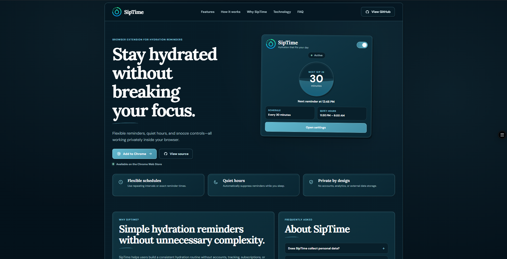
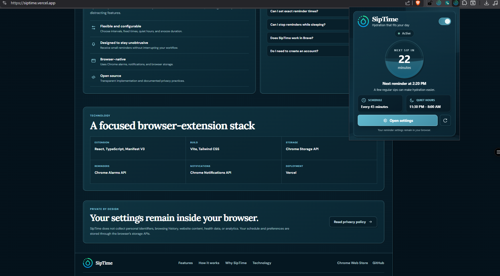
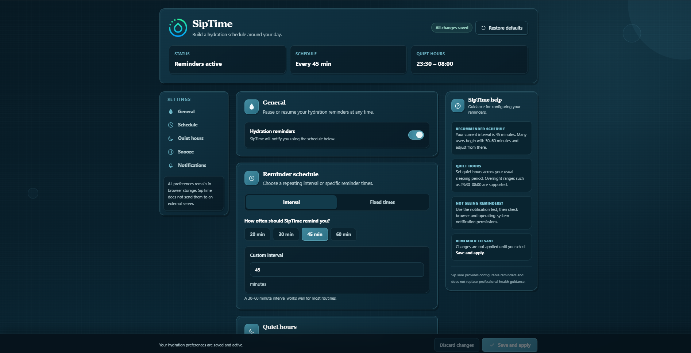
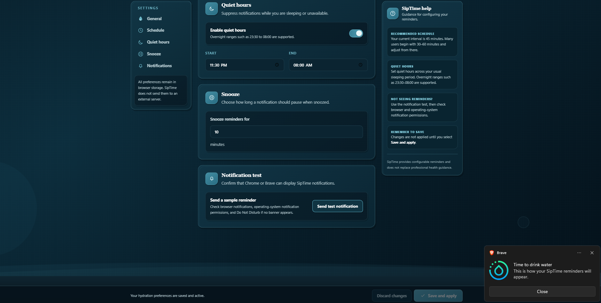

<div align="center">


# SipTime

### Calm, configurable hydration reminders that run inside your browser.

SipTime is a privacy-focused Chrome and Brave extension that helps users build a consistent hydration routine through interval reminders, fixed reminder times, quiet hours, and snooze controls.

[](https://siptime.vercel.app/)
[](https://chromewebstore.google.com/detail/siptime/npjkkjooolnpkpmleojnembmiaeccnml)
[](https://github.com/jayasuryapazhani/SipTime)
[](LICENSE)

</div>

---

## Table of Contents

- [Overview](#overview)
- [Live Links](#live-links)
- [Screenshots](#screenshots)
- [Features](#features)
- [How SipTime Works](#how-siptime-works)
- [Technology Stack](#technology-stack)
- [Chrome Extension Permissions](#chrome-extension-permissions)
- [Architecture](#architecture)
- [Project Structure](#project-structure)
- [Installation](#installation)
- [Local Development](#local-development)
- [Available Scripts](#available-scripts)
- [Production Build](#production-build)
- [Testing Checklist](#testing-checklist)
- [Landing Page Deployment](#landing-page-deployment)
- [Privacy](#privacy)
- [Browser Support](#browser-support)
- [Release Process](#release-process)
- [Roadmap](#roadmap)
- [Contributing](#contributing)
- [License](#license)
- [Author](#author)

---

## Overview

SipTime is a Manifest V3 browser extension designed to provide useful hydration reminders without introducing accounts, subscriptions, analytics, or unnecessary complexity.

Users can choose between:

- Repeating interval reminders
- Fixed reminder times
- Configurable quiet hours
- Custom snooze durations

The extension runs through a Chrome background service worker, schedules reminders with the Chrome Alarms API, displays browser notifications through the Chrome Notifications API, and stores preferences with the Chrome Storage API.

SipTime also includes a responsive product landing page deployed to Vercel.

---

## Live Links

| Resource | Link |
|---|---|
| Live website | [https://siptime.vercel.app/](https://siptime.vercel.app/) |
| Chrome Web Store | [Install SipTime](https://chromewebstore.google.com/detail/siptime/npjkkjooolnpkpmleojnembmiaeccnml) |
| GitHub repository | [github.com/jayasuryapazhani/SipTime](https://github.com/jayasuryapazhani/SipTime) |
| Privacy policy | [PRIVACY.md](PRIVACY.md) |
| License | [MIT License](LICENSE) |

---

## Screenshots

### Landing Page

<p align="center">
  
</p>

### Extension Interface

<table>
  <tr>
    <td width="38%" align="center">
      <strong>Popup</strong>
    </td>
    <td width="62%" align="center">
      <strong>Settings</strong>
    </td>
  </tr>
  <tr>
    <td valign="top">
      
    </td>
    <td valign="top">
      
    </td>
  </tr>
</table>

### Hydration Notification

<p align="center">
  
</p>

---

## Features

### Flexible Reminder Scheduling

SipTime supports two reminder modes:

- **Interval mode** — receive a reminder every configured number of minutes.
- **Fixed-times mode** — receive reminders at one or more exact times during the day.

### Quiet Hours

Quiet hours suppress notifications during a configured period.

The scheduling logic supports:

- Same-day ranges, such as `13:00–17:00`
- Overnight ranges, such as `23:30–08:00`

### Snooze Controls

Each hydration notification provides:

- **Done** — dismiss the current reminder.
- **Snooze** — delay the reminder using the configured snooze duration.

### Live Reminder Status

The popup displays:

- Whether reminders are active
- Current reminder mode
- The next scheduled reminder
- Quiet-hours status
- Quick access to the settings page

### Settings Management

The settings page provides:

- Reminder enable or disable control
- Interval and fixed-time configuration
- Quiet-hours configuration
- Snooze-duration configuration
- Validation feedback
- Unsaved-change indicators
- Save, discard, and restore-default actions
- Test-notification support

### Privacy-Focused Operation

SipTime does not require:

- An account
- A login
- A subscription
- Website access
- Browsing-history access
- Content scripts
- A SipTime backend server

### Responsive Landing Page

The repository also contains the official SipTime landing page with:

- Product overview
- Extension preview
- Feature documentation
- FAQ
- Privacy summary
- Technology overview
- Chrome Web Store and GitHub links
- Responsive desktop and mobile layouts

---

## How SipTime Works

1. The user enables reminders and saves a schedule.
2. SipTime stores the configuration through the Chrome Storage API.
3. The background service worker creates or updates Chrome alarms.
4. When an alarm fires, SipTime checks whether reminders are enabled.
5. SipTime checks whether the current time is inside quiet hours.
6. When reminders are allowed, SipTime creates a browser notification.
7. The user can dismiss the reminder or snooze it.
8. SipTime calculates and stores the next reminder time for the popup.

The reminder schedule is recalculated when:

- The extension is installed
- The browser starts
- Reminder settings change
- A fixed-time reminder fires
- A reminder is snoozed

---

## Technology Stack

### Extension

| Technology | Purpose |
|---|---|
| React | Popup, settings page, and landing-page interfaces |
| TypeScript | Type-safe application and extension logic |
| Vite | Development server and production bundling |
| Tailwind CSS | Utility styling for extension interfaces |
| CSS | Custom dark-water theme and landing-page design |
| Manifest V3 | Chrome extension platform |
| Chrome Alarms API | Reminder scheduling |
| Chrome Notifications API | Hydration notifications and action buttons |
| Chrome Storage API | Reminder preferences and next-reminder state |

### Development and Deployment

| Technology | Purpose |
|---|---|
| ESLint | Static analysis and code-quality checks |
| PostCSS | CSS processing |
| Autoprefixer | Browser-compatible CSS prefixes |
| Git and GitHub | Version control and source hosting |
| Vercel | Landing-page deployment |

---

## Chrome Extension Permissions

SipTime requests only the permissions required for its core functionality.

| Permission | Reason |
|---|---|
| `alarms` | Schedule interval, fixed-time, and snoozed reminders |
| `notifications` | Display hydration reminders with Done and Snooze actions |
| `storage` | Save reminder preferences and next-reminder information |

SipTime does **not** request:

- Host permissions
- Access to webpage content
- Browsing-history access
- Tab access
- Location access
- Camera or microphone access

---

## Architecture

SipTime is organized into four main application areas.

### Background Service Worker

`src/background/background.ts`

Responsible for:

- Scheduling Chrome alarms
- Rescheduling after installation and browser startup
- Responding to settings changes
- Evaluating quiet hours
- Creating hydration notifications
- Handling Done and Snooze actions
- Calculating the next fixed reminder

### Popup Application

`src/popup/`

Responsible for:

- Displaying reminder status
- Showing the next reminder
- Enabling or disabling reminders
- Refreshing current state
- Opening the settings page

### Settings Application

`src/options/`

Responsible for:

- Editing reminder preferences
- Switching reminder modes
- Configuring fixed times
- Configuring quiet hours
- Configuring snooze duration
- Validating user input
- Saving, discarding, and restoring settings
- Sending test notifications

### Shared Extension Logic

`src/shared/`

Contains:

- Shared TypeScript types
- Default reminder settings
- Chrome storage helpers
- Shared state contracts

### Landing Page

`src/site/`

Contains:

- The SipTime marketing website
- Product information
- Feature descriptions
- FAQ content
- Privacy summary
- Responsive site styles

---

## Project Structure

```text
SipTime/
├── docs/
│   └── images/
│       ├── siptime-landing-page.png
│       ├── siptime-notification.png
│       ├── siptime-popup.png
│       └── siptime-settings.png
│
├── public/
│   └── icon.png
│
├── src/
│   ├── background/
│   │   └── background.ts
│   │
│   ├── options/
│   │   ├── main.tsx
│   │   └── optionsApp.tsx
│   │
│   ├── popup/
│   │   ├── main.tsx
│   │   └── popupApp.tsx
│   │
│   ├── shared/
│   │   ├── storage.ts
│   │   └── types.ts
│   │
│   ├── site/
│   │   ├── main.tsx
│   │   ├── siteApp.tsx
│   │   └── site.css
│   │
│   └── index.css
│
├── index.html
├── manifest.json
├── options.html
├── popup.html
├── PRIVACY.md
├── LICENSE
├── package.json
├── package-lock.json
├── postcss.config.js
├── tailwind.config.js
├── tsconfig.json
├── vite.config.ts
└── README.md
```

---

## Installation

### Install from the Chrome Web Store

Install the published extension from:

[**SipTime on the Chrome Web Store**](https://chromewebstore.google.com/detail/siptime/npjkkjooolnpkpmleojnembmiaeccnml)

After installation:

1. Open the Extensions menu in Chrome or Brave.
2. Pin SipTime to the browser toolbar.
3. Open the SipTime popup.
4. Open **Settings**.
5. Configure and save your reminder schedule.

### Install Locally for Development

#### Prerequisites

- Node.js
- npm
- Google Chrome or Brave
- Git

#### Clone the Repository

```bash
git clone https://github.com/jayasuryapazhani/SipTime.git
cd SipTime
```

#### Install Exact Dependencies

```bash
npm ci
```

#### Create a Production Build

```bash
npm run build
```

#### Load the Extension

In Chrome:

```text
chrome://extensions
```

In Brave:

```text
brave://extensions
```

Then:

1. Enable **Developer mode**.
2. Select **Load unpacked**.
3. Choose the generated `dist` directory.
4. Pin SipTime to the browser toolbar.

After each extension build, return to the extensions page and select **Reload** for SipTime.

---

## Local Development

### Start the Landing Page

```bash
npm run dev
```

Open:

```text
http://localhost:5173
```

The Vite development server is primarily used to develop and preview the landing page.

### Develop the Extension

Extension development uses the production output because Chrome loads the extension from `dist`.

```bash
npm run build
```

Then reload the unpacked extension from:

```text
chrome://extensions
```

### Preview the Production Website Build

```bash
npm run preview
```

---

## Available Scripts

| Command | Description |
|---|---|
| `npm run dev` | Start the Vite development server |
| `npm run build` | Run TypeScript checks and create the production build |
| `npm run lint` | Run ESLint across the project |
| `npm run preview` | Preview the production website build locally |

For reproducible dependency installation, use:

```bash
npm ci
```

---

## Production Build

Run:

```bash
npm run lint
npm run build
```

The build output is written to:

```text
dist/
```

The multi-entry Vite build generates both the landing page and extension files.

Expected output includes:

```text
dist/
├── assets/
├── background.js
├── icon.png
├── index.html
├── manifest.json
├── options.html
└── popup.html
```

### Build Validation

Before committing or publishing:

```bash
npm run lint
npm run build
git diff --check
git status
```

---

## Testing Checklist

### Popup

- [ ] Popup opens without console errors
- [ ] SipTime logo loads correctly
- [ ] Reminder status is accurate
- [ ] Enable or disable control works
- [ ] Next-reminder time is displayed
- [ ] Refresh action updates the state
- [ ] Settings action opens the options page
- [ ] Popup does not show unnecessary scrollbars

### Settings

- [ ] Existing settings load correctly
- [ ] Interval mode can be selected and saved
- [ ] Fixed-time mode can be selected and saved
- [ ] Fixed reminder times can be added and removed
- [ ] Quiet hours can be enabled and disabled
- [ ] Overnight quiet hours work
- [ ] Snooze duration can be changed
- [ ] Invalid values display validation feedback
- [ ] Unsaved-change state is shown
- [ ] Save action persists changes
- [ ] Discard action restores saved values
- [ ] Restore defaults works
- [ ] Test notification appears
- [ ] Only one document scrollbar is displayed

### Background Reminders

- [ ] Interval alarms are scheduled
- [ ] Fixed-time alarms are scheduled
- [ ] Settings changes reschedule alarms
- [ ] Browser startup reschedules reminders
- [ ] Quiet hours suppress notifications
- [ ] Done dismisses the notification
- [ ] Snooze creates a delayed reminder
- [ ] The next-reminder timestamp updates

### Landing Page

- [ ] Production website loads
- [ ] Logo and favicon load
- [ ] Header navigation scrolls correctly
- [ ] Chrome Web Store link works
- [ ] GitHub link works
- [ ] Privacy-policy link works
- [ ] FAQ sections expand and collapse
- [ ] Desktop layout is correct
- [ ] Tablet layout is correct
- [ ] Mobile layout is correct
- [ ] Browser console contains no errors

---

## Landing Page Deployment

The SipTime landing page is deployed with Vercel:

[https://siptime.vercel.app/](https://siptime.vercel.app/)

### Vercel Configuration

| Setting | Value |
|---|---|
| Framework preset | Vite |
| Root directory | `./` |
| Install command | `npm ci` |
| Build command | `npm run build` |
| Output directory | `dist` |
| Production branch | `main` |

No environment variables are required.

Pushes to `main` trigger production deployments. Development branches can generate Vercel preview deployments when Git integration is enabled.

---

## Privacy

SipTime is designed to operate without a SipTime-owned backend.

The extension does not collect or intentionally transmit:

- Personal identifiers
- Health information
- Browsing history
- Website content
- Location information
- Usage analytics
- Advertising identifiers

Reminder preferences and the next-reminder timestamp are stored with `chrome.storage.sync`.

Depending on the browser and the user's synchronization settings, Chrome or Brave may synchronize extension storage through the user's browser account. SipTime does not operate a server that receives or processes this information.

For the complete policy, read [PRIVACY.md](PRIVACY.md).

---

## Browser Support

| Browser | Support |
|---|---|
| Google Chrome | Supported |
| Brave | Supported |
| Microsoft Edge | Expected to work as a Chromium browser, but not formally tested |
| Other Chromium browsers | May work, but are not formally tested |
| Firefox | Not currently supported |
| Safari | Not currently supported |

Notification behavior may depend on browser and operating-system notification settings.

### Windows Notification Troubleshooting

When reminders do not appear:

1. Open Windows notification settings.
2. Confirm notifications are enabled.
3. Confirm Chrome or Brave notifications are enabled.
4. Confirm notification banners are allowed.
5. Disable **Do Not Disturb** or add the browser as an exception.
6. Use SipTime's **Test notification** action.
7. Check the extension console for errors.

---

## Release Process

### 1. Update the Extension Version

Update the version in:

```text
manifest.json
```

Keep the project version in `package.json` synchronized when preparing a formal release.

Chrome extension versions use numeric components, for example:

```json
{
  "version": "1.1.0"
}
```

### 2. Validate the Project

```bash
npm ci
npm run lint
npm run build
git diff --check
```

### 3. Test the Unpacked Build

Load or reload `dist` and complete the testing checklist.

### 4. Create the Store Package

On PowerShell:

```powershell
Compress-Archive `
  -Path .\dist\* `
  -DestinationPath .\siptime-extension.zip `
  -Force
```

The ZIP archive must contain the contents of `dist` at its root. It should not contain an additional nested `dist` directory.

### 5. Upload to the Chrome Web Store

1. Open the Chrome Web Store Developer Dashboard.
2. Select SipTime.
3. Upload the new ZIP archive.
4. Update release notes and screenshots when required.
5. Submit the release for review.

### 6. Tag the Git Release

Example:

```bash
git tag -a v1.1.0 -m "SipTime v1.1.0"
git push origin v1.1.0
```

---

## Roadmap

Potential future improvements include:

- Optional reminder sounds
- Additional notification messages
- More schedule presets
- Local hydration-history summaries
- Theme preferences
- Import and export of settings
- Keyboard-accessibility improvements
- Additional automated tests
- Localization
- Expanded browser compatibility

Roadmap items are exploratory and are not guaranteed release commitments.

---

## Contributing

Contributions, bug reports, and improvement proposals are welcome.

### Development Workflow

1. Fork the repository.
2. Create a descriptive branch.
3. Make one focused change.
4. Run validation.
5. Commit the change.
6. Push the branch.
7. Open a pull request.

Example:

```bash
git switch -c improve-notification-accessibility
npm ci
npm run lint
npm run build
git add .
git commit -m "improve notification accessibility"
git push -u origin improve-notification-accessibility
```

A pull request should include:

- A clear description of the change
- The reason for the change
- Testing performed
- Screenshots for visual changes
- Any known limitations

---

## License

SipTime is distributed under the [MIT License](LICENSE).

---

## Author

**Jayasurya Pazhani**

- GitHub: [@jayasuryapazhani](https://github.com/jayasuryapazhani)
- Website: [https://siptime.vercel.app/](https://siptime.vercel.app/)
- Email: [projects.jayasurya@gmail.com](mailto:projects.jayasurya@gmail.com)

---

<div align="center">

Built to make hydration reminders simple, private, and unobtrusive.

[Install SipTime](https://chromewebstore.google.com/detail/siptime/npjkkjooolnpkpmleojnembmiaeccnml) ·
[Visit the Website](https://siptime.vercel.app/) ·
[View the Source](https://github.com/jayasuryapazhani/SipTime)

</div>